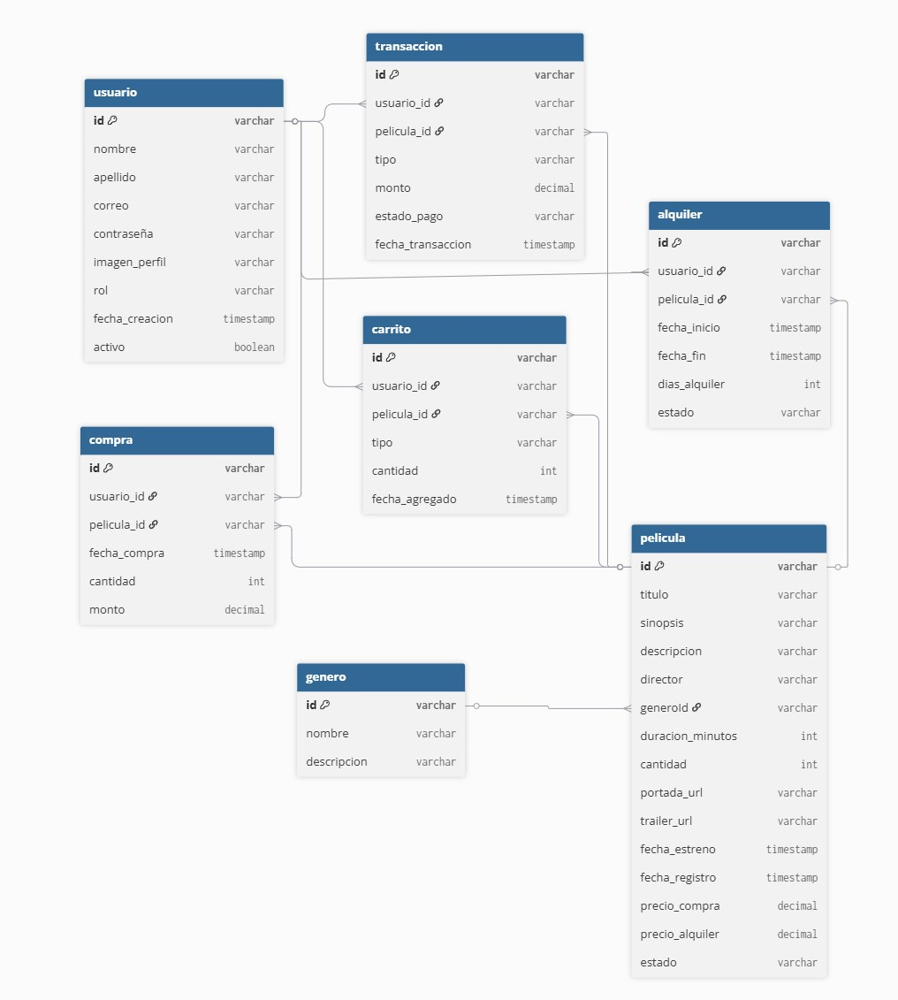
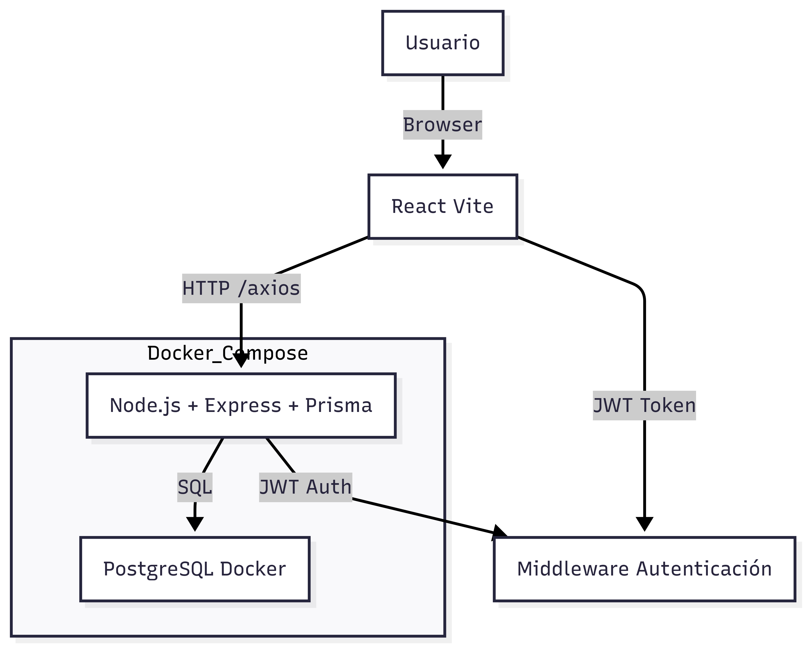
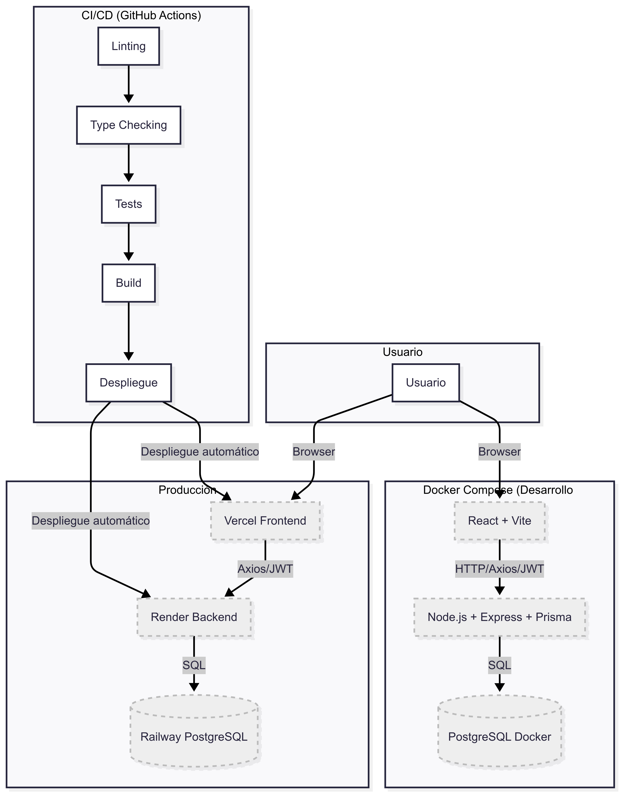
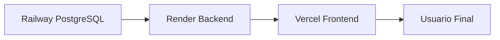

#
# 🎬 CinePerú - v2.0.0

## 🧾 1. Descripción del Proyecto – CinePerú

**Nombre del proyecto:** CinePerú  
**Tipo de aplicación:** Plataforma web responsiva para compra y alquiler de películas  
**Tecnología principal:** React + Node.js + PostgreSQL + Docker  
**Usuarios finales:** Público general del Perú interesado en ver películas en línea

### 🧐 ¿Qué es CinePerú?

CinePerú es una plataforma de streaming y gestión de películas que permite a los usuarios explorar una cartelera virtual con:

• Películas en estreno  
• Próximos estrenos  
• Recientemente agregadas  
• Disponibles para comprar o alquilar  

**Funciones principales del sistema:**
• Registro con correo y autenticación con Google  
• Navegación pública sin registro  
• Compra o alquiler de películas (sin integración de pasarela de pagos, solo simulado)  
• Visualización del historial de compras y alquileres  
• Verificación del estado de alquiler (vigente o vencido)  
• Edición del perfil de usuario  

### � Novedades CI/CD y Automatización

- **CI/CD profesional:**
  - GitHub Actions para lint, test y build en frontend y backend.
  - Deploy automático del backend en Render solo si pasan los tests.
  - Deploy del frontend en Vercel.
  - Railway solo como base de datos (sin deploy automático de backend).
- **Automatización y calidad:**
  - Linting y type-checking estrictos con ESLint y TypeScript.
  - Validación de tests antes de cada deploy.
  - Separación de contextos React para Fast Refresh.
  - Uso de hooks y tipado seguro en todo el frontend.
- **Despliegue seguro:**
  - El backend solo se despliega si los tests pasan (ver `.github/workflows/ci.yml`).
  - El frontend se despliega automáticamente en Vercel.

### �💻 Tecnologías utilizadas

| Categoría | Tecnología |
|-----------|------------|
| Frontend | React + Vite + TypeScript + Tailwind CSS |
| Backend | Node.js + Express + TypeScript |
| Base de Datos | PostgreSQL |
| ORM | Prisma |
| Autenticación | JWT y OAuth2 (Google) |
| Contenedores | Docker + Docker Compose (desarrollo) |
| Deployment | Backend en **Render**, PostgreSQL en **Railway**, Frontend en **Vercel** |
| Seguridad | Cifrado con bcrypt, Middleware con JWT, protección contra SQLi |

### � Autenticación y usuarios

• Registro con correo y contraseña  
• Autenticación con Google mediante OAuth2  
• Cifrado de contraseñas con bcrypt  
  - Ejemplo: `bcrypt.hash(contraseña, 10)` en auth.service.ts  
• Tokens JWT con expiración (1 día)  
  - Ejemplo: `expiresIn: '1d'` en jwt.ts  
• Middleware de protección de rutas (auth.middleware.ts)  
• Roles de usuario:  
  - Usuario estándar (por defecto)  
  - Administrador (gestiona películas, usuarios, etc.)  

### 💳 Gestión de pagos (simulada)

• Moneda: Soles peruanos (PEN)  
• Actualmente **NO** hay integración real con pasarelas de pago (Mercado Pago, Yape, etc.)
• El flujo de compra y alquiler es simulado para efectos de pruebas y experiencia de usuario.
• Registro de transacciones exitosas (simuladas)
• Verificación del vencimiento en los alquileres

### 📱 Diseño responsivo

El diseño sigue una estrategia mobile-first, adaptándose a:
• Dispositivos móviles  
• Tablets  
• Computadoras de escritorio  

---

## � 2. Alcance del Proyecto – CinePerú

### 🎯 Objetivo general

Desarrollar una aplicación web responsiva que permita a usuarios del Perú comprar o alquilar películas de forma segura, administrando su perfil, pagos e historial de forma eficiente.

### ✅ Funcionalidades principales (MVP)

**Usuarios no autenticados:**
• Navegar por:  
  - Cartelera actual  
  - Próximos estrenos  
  - Recientes agregadas  
• Buscar películas  
• Ver detalles de cada película  
• Registro / Inicio de sesión (correo o Google)  

**Usuarios autenticados:**
• Comprar o alquilar películas  
• Visualizar historial de películas  
• Ver estado del alquiler (vigente / vencido)  
• Editar perfil (nombre, correo, imagen, etc.)  
• Notificaciones por vencimiento de alquiler  

**Administradores:**
• CRUD de películas (crear, editar, eliminar)  
• Subir trailers, portadas, sinopsis, precios, etc.  
• Gestión de usuarios (bloqueo, historial, etc.)  

**General:**
• Interfaz responsive e intuitiva  
• Pagos en soles (PEN)  
• Backend con arquitectura MVC  
• Seguridad contra inyecciones SQL  

### 🔒 Reglas de negocio

• Los alquileres duran un tiempo definido (7 días)  
• Las compras son permanentes  
• Una película vencida no puede alquilarse nuevamente sin renovación  
• Solo se pueden visualizar películas alquiladas o compradas  
• Las películas no disponibles no pueden visualizarse ni alquilarse  

### 🧪 Fuera del alcance (por ahora)

• Streaming en vivo como Netflix (simulación con trailers y archivos MP4)  
• Aplicaciones móviles nativas  
• Multimoneda (solo moneda local: PEN)  

### � Tiempo estimado de desarrollo

| Fase | Duración estimada |
|------|-------------------|
| Diseño (BD y arquitectura) | 2-3 días |
| Backend (100%) | 6-7 días |
| Frontend (30%) | 4-5 días |
| Docker + Despliegue | 2 días |
| Pruebas + Documentación | 2 días |

---

## 🗂️ 3. Diseño de Base de Datos – CinePerú

• Motor: PostgreSQL  
• Modelado con Prisma ORM  
• Nombres en español, minúsculas y con snake_case  
• Relaciones principales:  
  - usuario ↔ películas  
  - usuario ↔ historial de compras/alquileres  
  - película ↔ administrador  




---

## 🏗️ 4. Diseño de Arquitectura

**Primer Borrador:**


**Arquitectura Final:**


### 🧱 Arquitectura

• Separación de capas (MVC)  
• Componentes desacoplados  
• Dockerizado para entornos homogéneos  
• Comunicación segura entre servicios  

### 🔐 Seguridad

• Cifrado de contraseñas con bcrypt  
• Autenticación con JWT (1 día de expiración)  
• Middleware de protección de rutas (auth.middleware.ts)  
• Inicio de sesión con OAuth2 (Google)  
• Prevención de ataques:  
  - Inyección SQL (validaciones y Prisma)  
  - CSRF y XSS (medidas básicas en headers y formularios)  

### 🌱 seed.js (Archivo de pre-carga de datos)

El archivo seed.js es útil para entornos de desarrollo. Este archivo:
• Crea un usuario administrador y un usuario estándar  
• Inserta películas de ejemplo en la base de datos  

---

## 🚀 5. Desarrollo e Instalación

### Prerrequisitos

- Node.js (v18 o superior)
- Docker y Docker Compose
- Git

### 💻 Instalación local

#### 1️⃣ Clonar el proyecto
```bash
git clone https://github.com/MaoTorresS/cineperu.git
cd cineperu
```

#### 2️⃣ Levantar backend + DB con Docker
```bash
docker compose up -d
```

#### 3️⃣ Iniciar el frontend
```bash
cd cineperu-frontend
npm install
npm run dev
```
- Frontend disponible en `http://localhost:5173`

### 🔄 Scripts útiles

#### 📦 Backend
```bash
cd cineperu-backend
npm install                    # Instalar dependencias
npm run dev                    # Modo desarrollo
npm run build                  # Compilar TypeScript
npm start                      # Producción
npx prisma migrate dev         # Aplicar migraciones
npx prisma studio             # Interfaz gráfica de BD
npx prisma db seed            # Cargar datos de ejemplo
```

#### 📦 Frontend
```bash
cd cineperu-frontend
npm install                    # Instalar dependencias
npm run dev                    # Modo desarrollo
npm run build                  # Build para producción
npm run preview               # Vista previa del build
```

---

## 🌐 6. Despliegue en Producción

### �️ Base de Datos - Railway (Primer paso)

1. **Crear cuenta en [Railway](https://railway.app)**
2. **Crear nuevo proyecto PostgreSQL**

### �🚀 Backend - Render (Segundo paso)

1. **Crear cuenta en [Render](https://render.com)**
2. **Conectar repositorio de GitHub**
3. **Seleccionar carpeta del backend:** `cineperu-backend`
5. **Configurar Build Command:**
   ```bash
   npm install && npm run build
   ```
6. **Configurar Start Command:**
   ```bash
   npm start
   ```
7. **Despliegue automático:** `https://cineperu-backend.onrender.com`

### 🔧 Ejecutar migraciones en producción

Una vez que el backend esté desplegado en Render:
```bash
# Desde tu máquina local, ejecutar:
npx prisma migrate deploy
npx prisma db seed
```

### 🎨 Frontend - Vercel (Tercer paso)

1. **Crear cuenta en [Vercel](https://vercel.com)**
2. **Conectar repositorio de GitHub**
3. **Configurar Build Settings:**
   - Framework Preset: `Vite`
   - Root Directory: `cineperu-frontend`
   - Build Command: `npm run build`
   - Output Directory: `dist`
4. **Configurar variables de entorno:**
   ```env
   VITE_API_URL=https://cineperu-backend.onrender.com
   ```

### 🔄 Flujo de despliegue



1. **Railway** hospeda la base de datos PostgreSQL
2. **Render** hospeda el backend Node.js/Express (conecta a Railway)
3. **Vercel** hospeda el frontend React (conecta a Render)
4. **Usuario** accede al frontend en Vercel

---

## 📁 Estructura del proyecto

```
cineperu/
│
├── cineperu-backend/           # Backend: API Express + Prisma + PostgreSQL
│   ├── src/
│   │   ├── app.ts              # Punto de entrada del servidor Express
│   │   ├── controladores/      # Lógica de endpoints (Controllers)
│   │   ├── middlewares/        # Autenticación, validaciones y subida de archivos
│   │   ├── rutas/              # Definición de rutas de la API
│   │   ├── servicios/          # Lógica de negocio y acceso a datos (Services)
│   │   ├── utils/              # Funciones auxiliares (JWT, Cloudinary, etc.)
│   │   ├── prisma/             # Cliente Prisma y scripts de seed
│   │   └── __tests__/          # Pruebas unitarias y de integración
│   ├── prisma/
│   │   ├── schema.prisma       # Esquema y modelo de la base de datos
│   │   └── migrations/         # Migraciones versionadas de la base de datos
│   ├── assets/                 # Diagramas, imágenes y recursos estáticos
│   ├── Dockerfile              # Imagen Docker del backend
│   ├── entrypoint.sh           # Script de inicialización para Docker
│   ├── package.json            # Dependencias y scripts del backend
│   ├── tsconfig.json           # Configuración de TypeScript
│   └── README_BACKEND.md       # Documentación técnica del backend
│
├── cineperu-frontend/          # Frontend: React + Vite + Tailwind CSS
│   ├── src/
│   │   ├── api/                # Configuración de Axios y servicios HTTP
│   │   ├── assets/             # Imágenes y recursos estáticos para componentes
│   │   ├── components/         # Componentes reutilizables de UI
│   │   ├── context/            # Contextos globales de React (Auth, Confirm, etc.)
│   │   ├── hooks/              # Custom hooks reutilizables
│   │   ├── layout/             # Componentes de layout (headers, wrappers)
│   │   ├── pages/              # Vistas principales de la aplicación
│   │   ├── routes/             # Definición de rutas y navegación
│   │   ├── styles/             # Estilos globales y personalizados
│   │   ├── App.tsx             # Componente raíz de la app
│   │   ├── main.tsx            # Punto de entrada de React
│   │   └── index.css           # Estilos base
│   ├── public/                 # Archivos estáticos públicos (favicon, imágenes)
│   ├── Dockerfile              # Imagen Docker del frontend (opcional)
│   ├── index.html              # HTML principal de la app
│   ├── package.json            # Dependencias y scripts del frontend
│   ├── tailwind.config.js      # Configuración de Tailwind CSS
│   ├── tsconfig.json           # Configuración de TypeScript
│   ├── vite.config.ts          # Configuración de Vite
│   └── README_FRONTEND.md      # Documentación técnica del frontend
│
├── docker-compose.yml          # Orquestación de backend y base de datos en desarrollo
├── .github/
│   └── workflows/
│       └── ci.yml              # Pipeline CI/CD con GitHub Actions
├── README.md                   # Documentación general del proyecto
└── ...
```

### 🏗️ Descripción de las carpetas principales:

**📂 Backend (`cineperu-backend/`):**
- `controladores/` - Manejan las peticiones HTTP y respuestas
- `servicios/` - Lógica de negocio y operaciones con la base de datos  
- `rutas/` - Definición de endpoints de la API
- `middlewares/` - Autenticación, validaciones y seguridad
- `prisma/` - Configuración y esquema de base de datos
- `utils/` - Funciones auxiliares (JWT, validaciones, etc.)

**📂 Frontend (`cineperu-frontend/`):**
- `pages/` - Páginas principales de la aplicación
- `components/` - Componentes React reutilizables
- `context/` - Manejo de estado global con Context API
- `routes/` - Configuración de rutas y navegación
- `api/` - Configuración para peticiones HTTP
- `public/portadas/` - Imágenes de las películas

---

### 🔧 Troubleshooting común

**Error de conexión a la base de datos:**
```bash
# Verificar que Docker esté corriendo
docker ps

# Reiniciar contenedores
docker compose down
docker compose up -d
```

**Problemas con migraciones:**
```bash
# Resetear base de datos (CUIDADO: borra todos los datos)
npx prisma migrate reset

# Aplicar migraciones manualmente
npx prisma db push
```

**Error de CORS en frontend:**
- Verificar que `VITE_API_URL` apunte al backend correcto
- Revisar configuración de CORS en `app.ts`

---

## � Licencia

MIT License GRUPO 02

---

## 🤝 Contribuciones

Las contribuciones son bienvenidas. Por favor:

1. Fork el proyecto
2. Crea una rama para tu feature (`git checkout -b feature/AmazingFeature`)
3. Commit tus cambios (`git commit -m 'Add some AmazingFeature'`)
4. Push a la rama (`git push origin feature/AmazingFeature`)
5. Abre un Pull Request

---

## � Contacto

**Desarrollado por:** Grupo 03  

**INTEGRANTES:**
- Melissa Nataly ORTIZ DIAZ
- JAZMIN YUSARA PACHECO HUAMAN
- MARLON WILFREDO TORRES SILVA
- BRISSETH BRIGITTE CACERES CONTRERAS

**GitHub:** [https://github.com/MaoTorresS/cineperu](https://github.com/MaoTorresS/cineperu)
