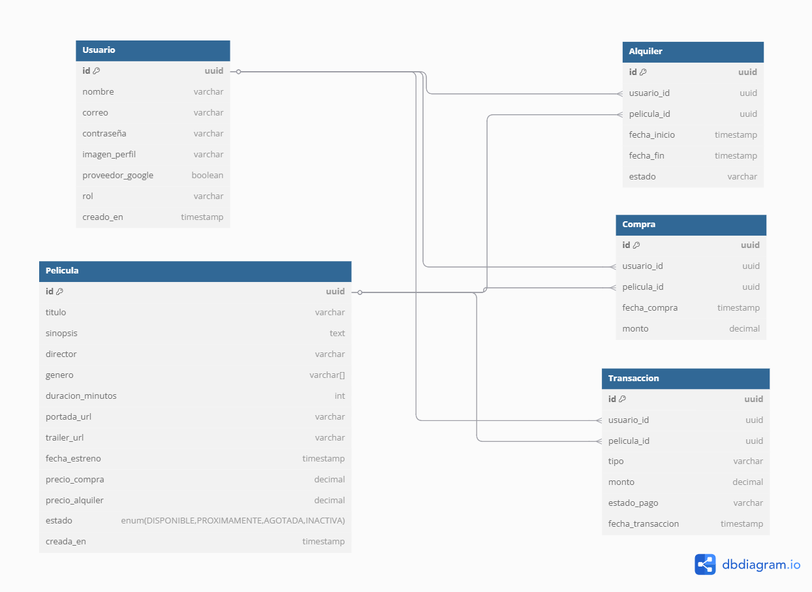

# 🎬 CinePerú - v1.0.0

Sistema web para alquiler y compra de películas, desarrollado como proyecto personal para practicar un stack moderno: Node.js, Express, PostgreSQL, Prisma, React, Tailwind y Docker.

## 📊 Diagrama de Base de Datos



---

## 🚀 Características principales

✅ Registro e inicio de sesión con JWT  
✅ Listado dinámico de películas  
✅ Backend API REST con Express y Prisma  
✅ Base de datos PostgreSQL orquestada con Docker  
✅ Frontend en React + Tailwind CSS  
🚧 Próximamente: compras y alquileres con historial

---

## 🛠 Tecnologías

- **Backend:** Node.js, Express, Prisma ORM, JWT
- **Base de datos:** PostgreSQL (Docker)
- **Frontend:** React (Vite), Tailwind CSS, Axios
- **DevOps:** Docker & Docker Compose

---

## 💻 Instalación local

### 1️⃣ Clonar el proyecto
```bash
git clone https://github.com/MaoTorresS/cineperu.git
cd cineperu
```

### 2️⃣ Levantar backend + DB con Docker
```bash
docker compose up -d
```
- API Node.js en `http://localhost:3000`
- PostgreSQL en `localhost:5432`  
  Usuario: `postgres`  
  Password: `01deabril`  
  DB: `postgres`

### 3️⃣ Iniciar el frontend
```bash
cd cineperu-frontend
npm install
npm run dev
```
- Frontend disponible en `http://localhost:5173`

---

## 📁 Estructura del proyecto

```
cineperu/
│
├── cineperu-backend/       # API Express + Prisma
├── cineperu-frontend/      # Frontend React + Tailwind
├── docker-compose.yml      # Orquesta DB + Backend
└── README.md               # Este archivo
```

---

## 📂 Extras

### 📦 Scripts útiles en el backend
```bash
cd cineperu-backend
npm install
npm run dev
npx prisma migrate dev
npx prisma studio
```

### 📦 Scripts útiles en el frontend
```bash
cd cineperu-frontend
npm install
npm run dev
npm run build
```

---

## 📝 Licencia

MIT License GRUPO 03
